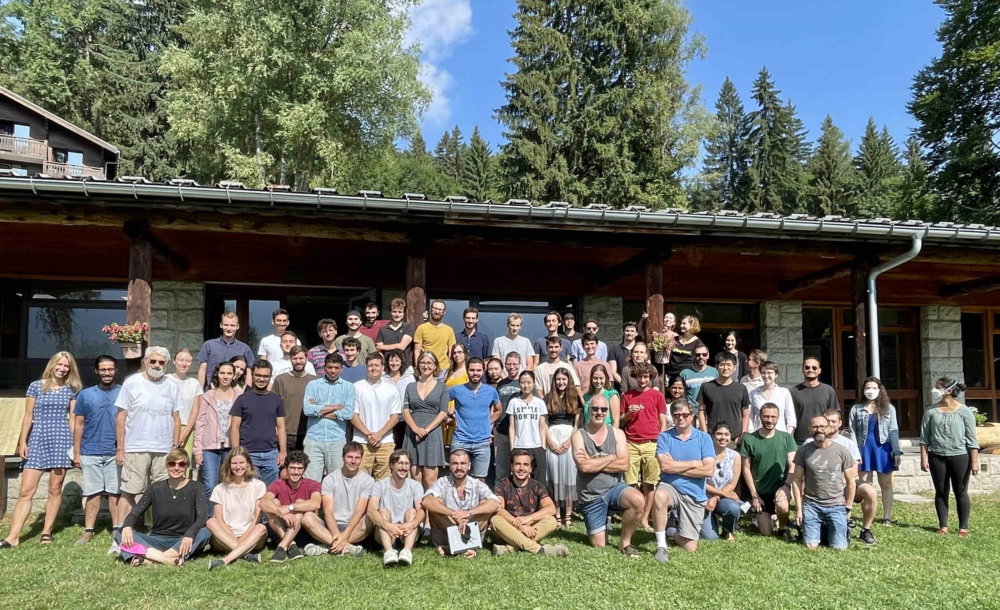
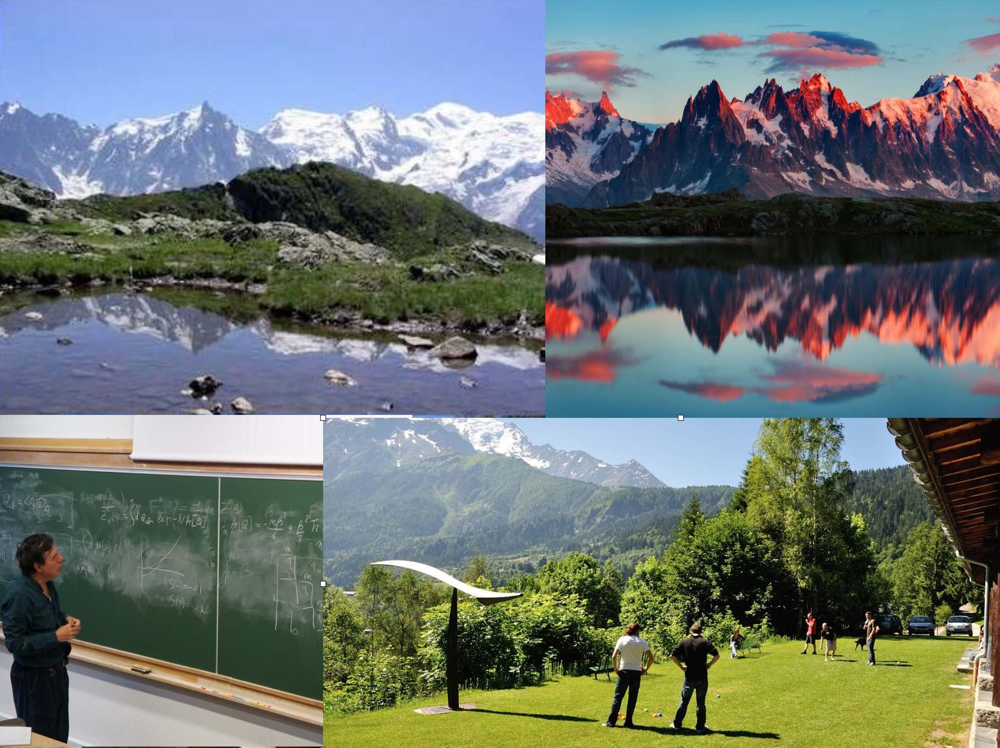
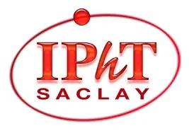

 **LES HOUCHES SCHOOL OF PHYSICS
SINCE 1951**

## Summer school on Statistical Physics of Machine learning
### **Organisers:** Florent Krzakala and Lenka Zdeborova, EPFL

### **Overview:** 
The school is aimed primarily at the growing audience of theoretical physicists, applied mathematicians, computer scientists and colleagues from other computational fields interested in machine learning, neural networks, and high-dimensional data analysis. We shall cover basics and frontiers of high-dimensional statistics, machine learning, theory of computing and statistical learning, and the related mathematics and probability theory. We will put a special focus on methods of statistical physics and their results in the context of current questions and theories related to these problems.  Open questions and directions will be discussed as well. 

 

### **Teachers:**
- Francis Bach (Inria, ENS) : *Sums-of-squares: from polynomials to kernels* [[videos]](https://www.youtube.com/watch?v=xyH7iZ7fs9o&ab_channel=LesHouches2022)
- Yasaman Bahri (Google) and Boris Hanin (Princeton) : *Deep Learning at Large and Infinite Width*
- Boaz Barak (Harvard) : *Computational Complexity of Deep learning: Fundamental limitations and Empirical phenomena* [[videos]](https://www.youtube.com/watch?v=PLyK7ADl0bw&list=PLEIq5bchE3R32vVNjHnDEUyFFFZsa17Ij&ab_channel=LesHouches2022)
- Giulio Biroli (ENS Paris) : *High-Dimensional Non-Convex Landscapes and Gradient Descent Dynamics* [[videos]](https://www.youtube.com/watch?v=yIyLQ_UmxsY&list=PLEIq5bchE3R1mwhv3NHa3gfHlX9Ss9DVr)
- Michael I. Jordan (Berkeley) *On decision, dynamics, incentives, and mechanisms design* [[videos]](https://www.youtube.com/watch?v=sRL6KXVPzn8&list=PLEIq5bchE3R3YzGjTH66tVHbBshI_HKec)
- Julia Kempe (NYU): *Data, Physics and Kernels and how can (statistical) physics tools help the DL practitioner*
- Yann LeCun (Facebook & NYU) : *From machine learning to autonomous intelligence* [[videos]](https://youtube.com/playlist?list=PLEIq5bchE3R3Yl5taXdYA04a9kH9yvyGm)
- Marc Mézard (ENS Paris) : *Belief propagation, Message-Passing & Sparse models*
- Remi Monasson (ENS Paris) : *Replica method for computational problems with randomness: principles and illustrations*  **Slides** [[1]](SLIDES/Remi_Monasson_Intro_to_replica_method.pdf),  [[2]](SLIDES/Remi_Monasson_lowD_manifolds_in_RNN.pdf), [[videos]](https://www.youtube.com/playlist?list=PLEIq5bchE3R1j7TMEeW-9xi22KPF3m2k5)
- Andrea Montanari (Stanford) : *Neural networks from a nonparametric viewpoint* [[videos]](https://www.youtube.com/playlist?list=PLEIq5bchE3R1hMF5Omlr-2t0nwKa0LrWL)
- Sara Solla (Northwestern Univ.): *Statistical Physics, Bayesian Inference and Neural Information Processing* **Slides** [[1]](SLIDES/Les%20Houches%200722%20-%20Lecture%201.pdf), [[2]](SLIDES/Les%20Houches%200722%20-%20Lecture%202.pdf),[[3]](SLIDES/Les%20Houches%200722%20-%20Lecture%203%20.pdf), [[videos]](https://www.youtube.com/watch?v=CisCradUosQ&list=PLEIq5bchE3R34TBXeKMBkUKkQ3u-IZMha)
- Haim Sompolinsky (Harvard & Hebrew Univ.): *Statistical Mechanics of Machine Learning* [[videos]](https://www.youtube.com/watch?v=sJswk8JhdOk&list=PLEIq5bchE3R2MM_qCYzDS_b4uOZQXdrBj&ab_channel=LesHouches2022)
- Nathan Srebro (TTI Chicago) *Applying statistical learning theory to deep learning* **Slides** [[1]](SLIDES/Les%20Hoches%202022%20intro%20part%201.pdf),  [[videos]](https://www.youtube.com/playlist?list=PLEIq5bchE3R1XjmCpiKc960umHySw3neU)
- Eric Vanden-Eijnden (NYU Courant) : *Benefits of overparametrization in statistical learning, & Enhancing MCMC Sampling with Learning*

### **Topics:**
- Phase transition in machine learning
- Computational complexity 
- Dynamics of learning in high-dimension 
- Message passing algorithms
- Challenges in machine learning
- Statistical physics of deep neural networks
- High-dimensional statistics 
- Optimization and implicit regularisation
- Replica and cavity methods
- Probability theory and rigorous approaches
- Statistical inference in high-dimension
- Computational learning theory

### **Calendar**
<iframe src="https://calendar.google.com/calendar/embed?height=600&wkst=2&bgcolor=%23ffffff&ctz=Europe%2FZurich&mode=WEEK&src=aWRlcGhpY3NsYWJAZ21haWwuY29t&color=%23039BE5;dates=20220704/20220710" style="border:solid 1px #777" width="800" height="600" frameborder="0" scrolling="no"></iframe>

<a href="https://twitter.com/intent/tweet?button_hashtag=Leshouches2022&ref_src=twsrc%5Etfw" class="twitter-hashtag-button" data-show-count="false">Tweet #Leshouches2022</a>

### **Participants:**
Find [here the list of participants](participants.md) to the school.

Click [here](img/leshouches.pdf) for the poster of the conference.

 

### Sponsors

