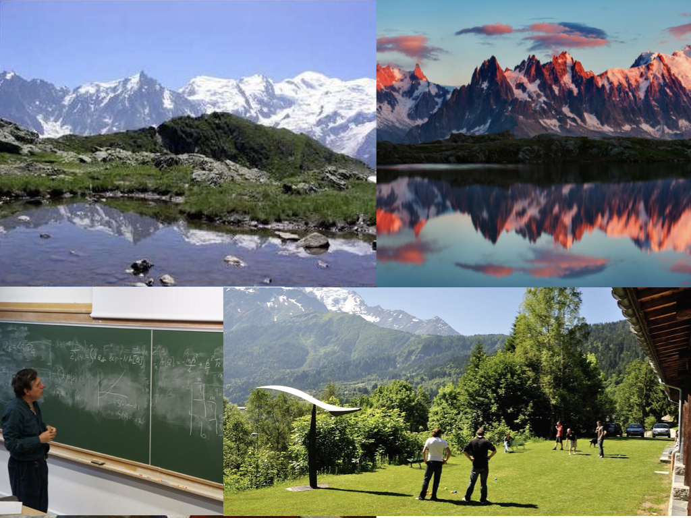

 **LES HOUCHES SCHOOL OF PHYSICS
SINCE 1951**

## Summer school on Statistical Physics of Machine learning

### **Organisers:** Florent Krzakala and Lenka Zdeborova, EPFL

### **Overview:** 
The school is aimed primarily at the growing audience of theoretical physicists, applied mathematicians, computer scientists and colleagues from other computational fields interested in machine learning, neural networks, and high-dimensional data analysis. We shall cover basics and frontiers of high-dimensional statistics, machine learning, theory of computing and statistical learning, and the related mathematics and probability theory. We will put a special focus on methods of statistical physics and their results in the context of current questions and theories related to these problems.  Open questions and directions will be discussed as well. 

### **Teachers:**
- Yasaman Bahri (Google)
- Boaz Barak (Harvard)
- Giulio Biroli (ENS Paris)
- Michael I. Jordan (Berkeley)
- Yann LeCun (Facebook & NYU)
- Marc Mézard (ENS Paris)
- Remi Monasson (ENS Paris)
- Andrea Montanari (Stanford)
- Sara Solla (Northwestern Univ.)
- Haim Sompolinsky (Harvard & Hebrew Univ.)
- Nathan Srebro (TTI Chicago)
- Nike Sun (MIT)

### **Topics:**
- Phase transition in machine learning
- Computational complexity 
- Dynamics of learning in high-dimension 
- Message passing algorithms
- Challenges in machine learning
- Statistical physics of deep neural networks
- High-dimensional statistics 
- Optimization and implicit regularisation
- Replica and cavity methods
- Probability theory and rigorous approaches
- Statistical inference in high-dimension
- Computational learning theory

### **Registration:**
The online Applications are open:  [click here for inscription](https://formulaires.univ-grenoble-alpes.fr/en/houches-application-form-july-2022
). Applications  must reach the School before March 1, 2022 in order to be considered by the Selection Committee. The full cost per participant includes housing and meals, and is specified on the School’s Website. Further information can be found on the Website too. Click [here](img/leshouches.pdf) for the poster of the conference.

### Sponsors

